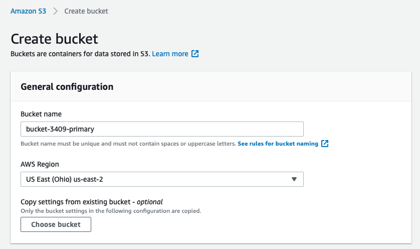
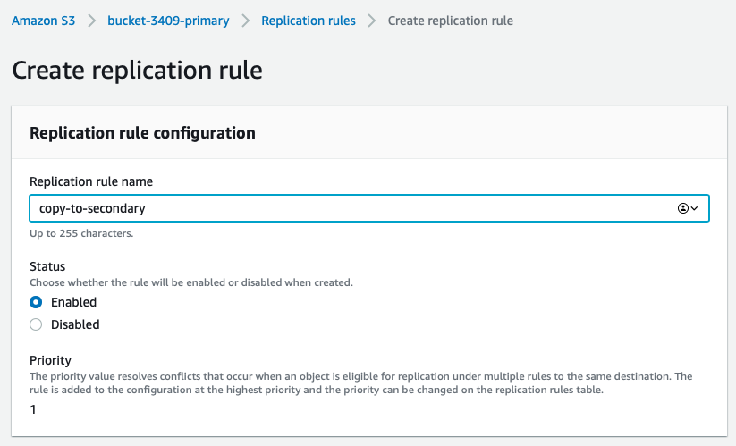
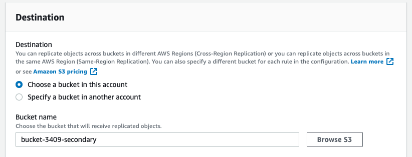
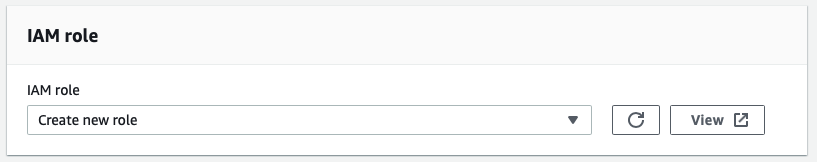

#### Crie o primeiro Bucket no Amazon S3

1. Acesse a console do Amazon S3: [https://s3.console.aws.amazon.com/s3](https://s3.console.aws.amazon.com/s3).
    *Obs: A Console do serviço Amazon S3 é Global, ou seja, serão listados os buckets de todas as regiões.*
2. Escolha **Create bucket (Criar bucket)**.
   - Digite um nome para seu bucket primário (Exemplo: **bucket-ACCOUNT-NUMBER-primary**
   - Selecione a região **us-east-2 (Ohio)**
   
   - Na mesma página ative a opção de versionamento de objetos do Bucket.
   
   - Selecione a opção **Create bucket (Criar bucket)**
   

#### Crie um segundo Bucket no Amazon S3

1. Acesse a console do Amazon S3: [https://s3.console.aws.amazon.com/s3](https://s3.console.aws.amazon.com/s3).
2. Escolha **Create bucket (Criar bucket)**.
   - Digite um nome para seu bucket primário (Exemplo: **bucket-ACCOUNT-NUMBER-secondary**
   - Selecione a região **us-west-2 (Oregon)**
   - Na mesma página ative a opção de versionamento de objetos do Bucket.
   - Selecione a opção **Create bucket (Criar bucket)**
   

#### Regra de replicação do bucket primário para o bucket secundário
1. Na console do Amazon S3, selecione a primeiro bucket criado (**primary**).
2. Acesse a guia **Management (Gerenciamento)**
3. Na seção **Replication rules (Regras de replicação)**, selecione **Create replication rule (Criar regra de replicação)**.
   - Digite um nome para a sua regra (Exemplo: **copy-to-secondary**).
   
   - Na seção **Source Bucket (bucket de origem)**, altere a regra de escopo para a opção **This rule applies to all objects in the bucket**
   
   - Na seção **Destination** digite o nome do seu bucket secundário (Exemplo:**bucket-ACCOUNT-NUMBER-secondary**).
   
   - Na seção **IAM role** selecione a opção **Create new role**.
   
   {}
   O Amazon S3 não pode replicar objetos sem sua permissão. Você concede permissões com a *Role* do IAM especificada na configuração de replicação. O Amazon S3 assume a *Role* do IAM para replicar objetos em seu nome.
   {}
   - Na seção **Additional replication options** marque todas as opções conforme a imagem abaixo:
   
   - Selecione **Save (Salvar)** 

#### Regra de replicação do bucket primário para o bucket secundário
1. Na console do Amazon S3, selecione o segundo bucket criado (**secondary**).
2. Acesse a guia **Management (Gerenciamento)**
3. Na seção **Replication rules (Regras de replicação)**, selecione **Create replication rule (Criar regra de replicação)**.
   - Digite um nome para a sua regra (Exemplo: **copy-to-primary**).
   - Na seção **Source Bucket (bucket de origem)**, altere a regra de escopo para a opção **This rule applies to all objects in the bucket**
   - Na seção **Destination** digite o nome do seu bucket secundário (Exemplo:**bucket-ACCOUNT-NUMBER-primary**).
   - Na seção **IAM role** selecione a opção **Create new role**.
   - Na seção **Additional replication options** marque todas as opções conforme a imagem abaixo:
   - Selecione **Save (Salvar)**

#### Verifique as regras de replicação
1. Execute o upload de arquivos no bucket primário.
2. Execute o upload de arquivos no bucket secundário.
3. Verifique que os arquivos são copiados para o bucket secundário. 

{}
É esperado que a replicação entre buckets ocorra em no máximo 15 minutos para 99,99% dos objetos.
{}

#### Apagando os recursos
1. Apague os dois buckets criados.

